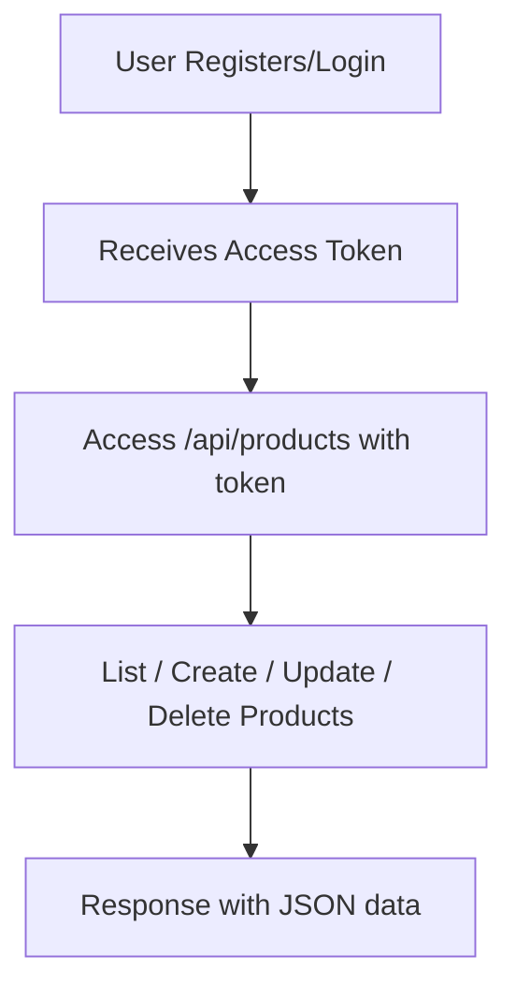

# Laravel Product API with Passport Authentication

A secure RESTful API built with **Laravel 12** and **Passport**, supporting user authentication and a full-featured product management system with **CRUD**, **filtering**, **sorting**, and **pagination**.

---

## 📚 Features

- 🔐 User Registration & Login via Laravel Passport (OAuth2)
- 🔐 Token-based Authentication
- 📦 Product Management API (CRUD)
- 🔍 Dynamic Filtering (`name`, `category`, `price`)
- ↕️ Sorting (`price`, `created_at` — ASC/DESC)
- 📄 Pagination using `per_page` query param
- 🧪 Tested via Postman (collection included)

---

## 🧰 Tech Stack

- PHP 8.x
- Laravel 12
- Laravel Passport
- MySQL
- Postman

---

## ⚙️ Installation

1. Clone the repo:
   ```bash
   git clone https://github.com/Hadi-pd/testpassport.git
   cd product-api-passport
   ```

2. Install dependencies:
   ```bash
   composer install
   ```

3. Copy `.env` and generate keys:
   ```bash
   cp .env.example .env
   php artisan key:generate
   ```

4. Set your database credentials in `.env`.

5. Run migrations:
   ```bash
   php artisan migrate
   ```

6. Install Passport:
   ```bash
   php artisan passport:install
   ```

7. Link Passport in `AuthServiceProvider`:
   ```php
   use Laravel\Passport\Passport;

   public function boot()
   {
       Passport::routes();
   }
   ```

8. In `config/auth.php`, set:
   ```php
   'guards' => [
       'api' => [
           'driver' => 'passport',
           'provider' => 'users',
       ],
   ],
   ```

9. Run the server:
   ```bash
   php artisan serve
   ```

---

## 🔐 Authentication Endpoints

| Method | Endpoint       | Description       |
|--------|----------------|-------------------|
| POST   | `/api/auth/register` | Register a new user     |
| POST   | `/api/auth/login`    | Login and receive token |
| GET    | `/api/user`          | Get Profile (Protected) |
| Delete | `/api/auth/logout`   | Login and receive token |

Sample Request:
```json
POST /api/register
{
  "name": "John Doe",
  "email": "john@example.com",
  "password": "secret",
  "password_confirmation": "secret"
}
```

---

## 📦 Product API Endpoints (Protected)

> All routes require Authorization header:  
> `Authorization: Bearer {access_token}`

| Method | Endpoint           | Description          |
|--------|--------------------|----------------------|
| GET    | `/api/products`     | List products (with filter/sort/paginate) |
| POST   | `/api/products`     | Create product       |
| GET    | `/api/products/{id}`| Show single product  |
| PUT    | `/api/products/{id}`| Update product       |
| DELETE | `/api/products/{id}`| Delete product       |

### 🔍 Filtering

You can filter products using query parameters:
```http
GET /api/products?name=phone&category=electronics&price=1000
```

### ↕️ Sorting

Sort by `price` or `created_at` using:
```http
GET /api/products?sort_by=price&sort_order=desc
```

### 📄 Pagination

Control items per page:
```http
GET /api/products?per_page=5
```

---

## 🧪 Postman

✅ A Postman collection is included in the repository:  
**`ProductAPI.postman_collection.json`**

You can import it and test:

- Register / Login
- Authenticated Product Management
- Filtering, Sorting, Pagination

---

## 🧠 Flowchart



---

## 🖼️ System Flowchart (Image)


---

## 🕐 Time Log

| Task                         | Time Spent | Notes |
|------------------------------|------------|-------|
| Laravel Project Setup        | 0.5 hr     | Install Laravel 12, Passport setup |
| Auth (Register/Login)        | 1 hr       | Token-based API, Test in Postman |
| Product CRUD API             | 1.5 hr     | Full REST API + validation |
| Filtering/Sorting/Pagination | 1 hr       | Dynamic queries based on request |
| Postman Testing              | 0.5 hr     | Collection with examples |
| Documentation & Flowchart    | 0.5 hr     | README + Mermaid chart |

---